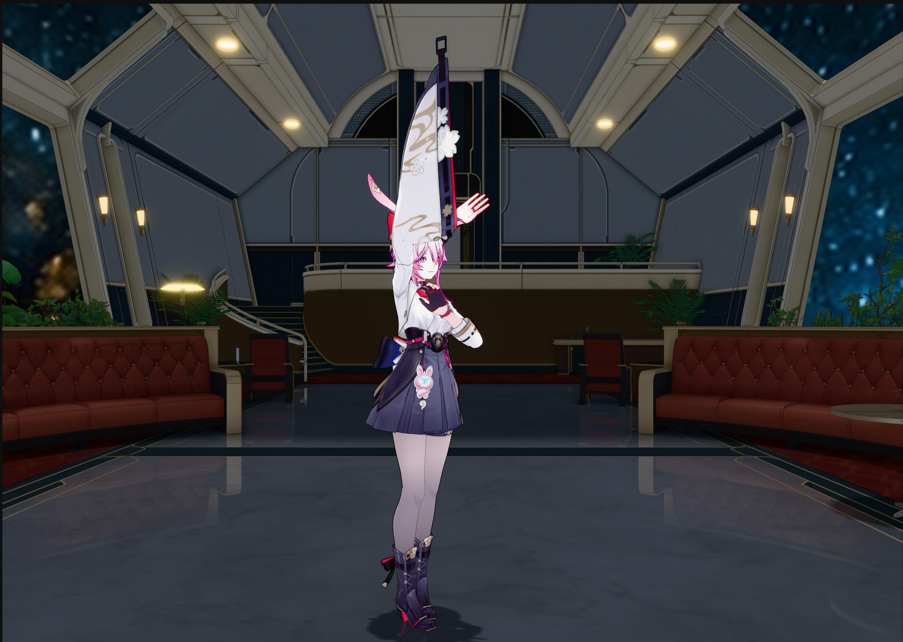
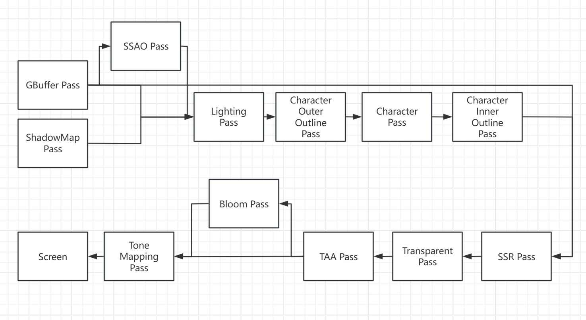
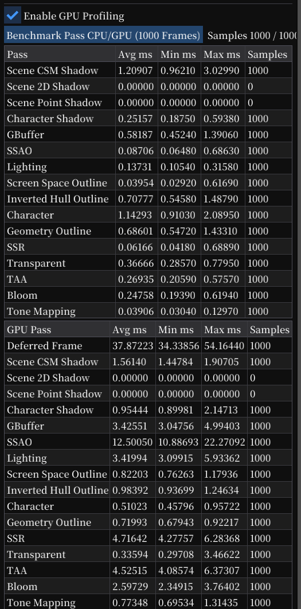
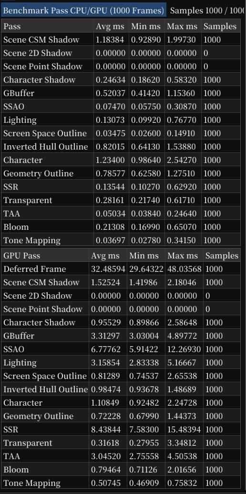
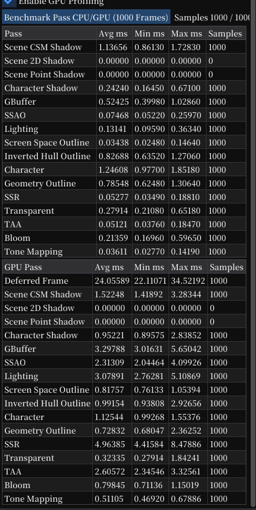
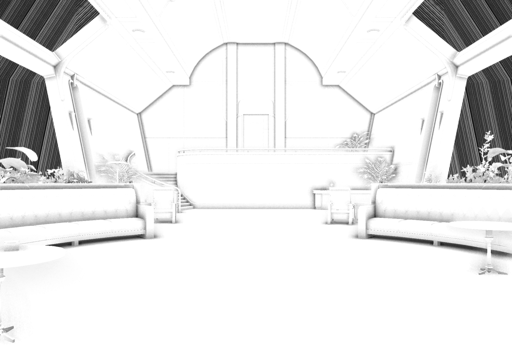
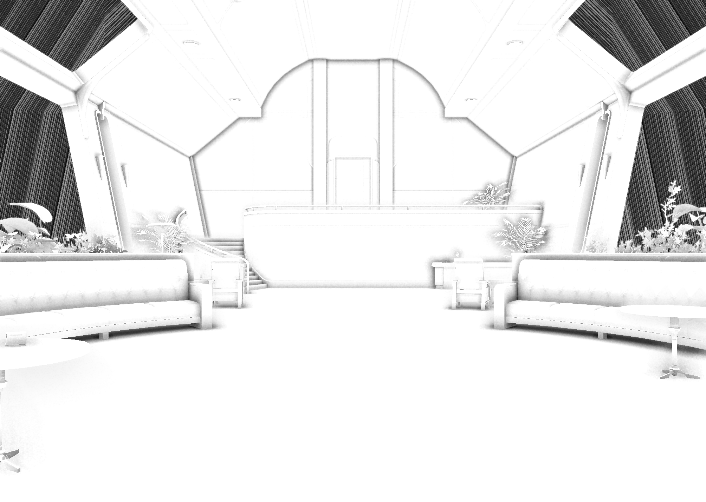
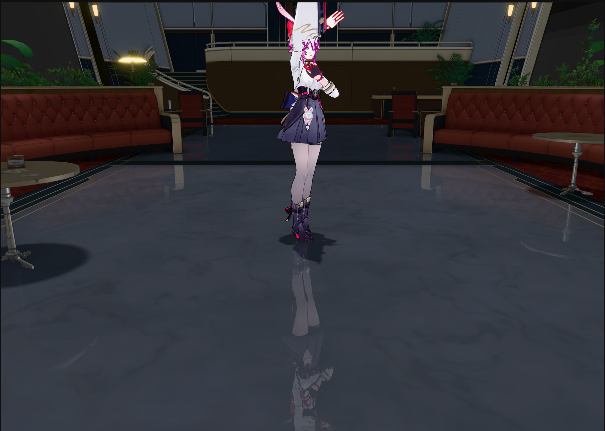
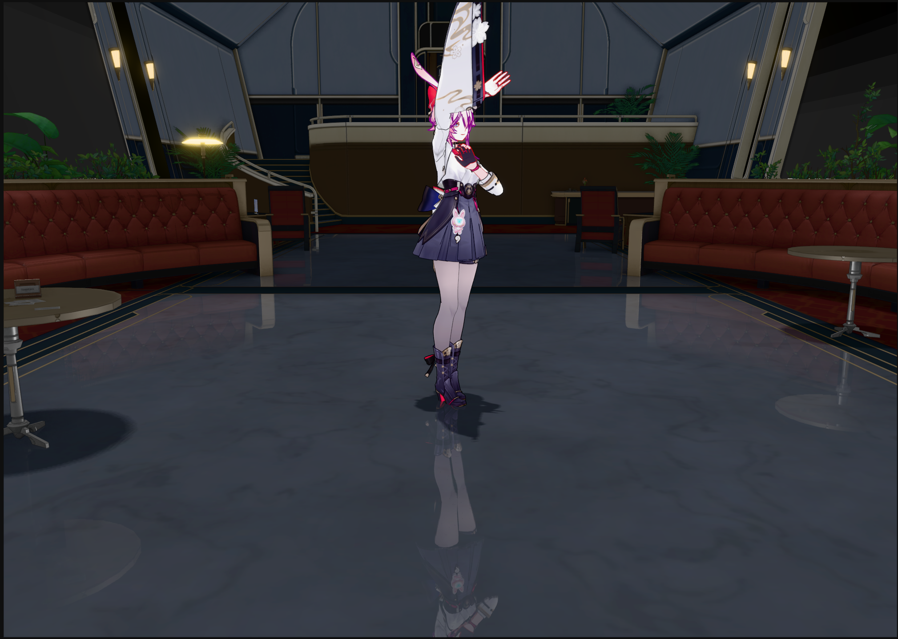

# 项目概述

本项目基于 The Cherno 开源的 Hazel 游戏引擎框架进行扩展，是一个面向实时图形渲染学习与工程实践的渲染引擎 Demo。在保留 Hazel 基础应用框架的同时，项目使用 C++ 与 OpenGL 4.6 重新搭建并扩展了 3D 模型、动画、材质及渲染管线。项目采用场景 Deferred Rendering 与角色 Forward Toon Rendering 相结合的混合管线，覆盖从模型、材质和动画导入到最终后处理输出的完整渲染流程。

目前已实现骨骼动画、CCD IK、PBR 与 Toon 着色、CSM、SSAO、Linear/Hi-Z SSR、TAA、Bloom、Tone Mapping，以及 Inverted Hull、屏幕空间和基于几何邻接信息的角色描边。同时提供 CPU/GPU Pass Profiling、RenderDoc Debug Group 和 Debug View，便于分析画面问题与定位性能瓶颈。

性能方面，项目针对视锥剔除、全屏 Pass 分辨率、TAA 采样数量和 SSR 光线步进方式进行了优化，并提供 Low 与 High 两档画质。当前测试场景在 Intel Core Ultra 9 275HX 核显、实际渲染分辨率 2009 x 1430 下，High 档 GPU 帧耗时约为 31.7-33.8 ms，Low 档约为 23.4-24.8 ms。该分辨率仅统计实际渲染画面，不包含 Inspector 等编辑器区域。

# 渲染数据提交框架

## 1. 资源导入
    使用 ModelImporter 封装Assimp, 将模型文件读入并创建对应的 Mesh, MaterialInstance, SubMesh 等资源，同时计算 SubMesh 的AABB, 并未角色生成几何描边所需的邻接边数据。

## 2. 场景更新及提交
    Scene 负责管理Entity 及其 Component。Scene::OnUpdata() 更新动画时间, 计算当前帧的骨骼矩阵, 并通过双缓冲保留上一帧的骨骼矩阵, 用于蒙皮和计算动画的Motion Vector

    每帧开始时, Renderer::BeginScene() 根据相机和Viewport 计算RenderView, 包括: View/Projection matrix， Camera Position， Near/Far Plane 等全局数据。

    随后，Scene::OnRender() 遍历场景Entity, 将可渲染数据的SubMesh 打包创建一个SceneSubmitItem, 包括: Mesh, MaterialInstance, AABB, Transform 等。

    同时, Scene 将光源数据单独打包, 包括: Type, Color, Intensity, Position 等。 由Scene 将光源数据和 SceneSubmitItem 提交给渲染器。

## 3. 渲染器处理
    Renderer::submit() 将SceneSubmitItem() 转换为当前渲染管线使用的RenderObject, 并保存到当前帧的RenderObject List。

    最终在Renderer::EndScene(), 由渲染器将 RenderView, RenderObject list, 光源数据 提交给 RenderPipeline 进行渲染

## 4. 渲染管线处理
    每个Mesh Pass 在Build() 阶段 从共享的RenderObject List 中提取自己所需要的对象, 依据RenderObject 的Type(Scene/Character)以及BlendMode 进行筛选, 并使用 AABB 执行视锥剔除。

    随后需要绘制的RenderObject 转换为DrawItem 保存。

    最后按照 Shader, Blend/Cull, Mesh 以及相机距离, 对 DrawItem 列表进行排序。

## 5. Render Pass 执行
    各Pass 在 Execute() 阶段, 将参数分层进行上传:
    1. Per-pass/frame 数据: 通过 UBO 或 Pass 开始时提交, 如 Camera, Lighting, Shadow 等;
    2. Per-item 数据: 遍历DrawItem, 在 DrawCall 前提交, 如 Model Matrix, Bone Buffer 等
    3. Material 数据: DrawItem 的材质参数, 在封装的 DrawCall 指令里提交

# 渲染管线

## 1. Shadow Map Pass
针对主光源分别生成场景阴影和角色阴影。测试场景使用方向光作为主光源；场景阴影采用四级 CSM，根据相机视锥划分不同深度范围，提高近景阴影精度和远景覆盖范围。角色阴影则根据角色世界空间 AABB 构建紧致的光源正交视锥，生成独立的 2D Shadow Map，从而减少无效阴影区域并提高角色阴影分辨率。

## 2. GBuffer Pass
接收场景中的不透明与 Alpha Cutout 物体，将材质和几何信息写入 GBuffer。主要输出包括 AlbedoAlpha、NormalRoughness、EmissiveMetallic 和 Motion Vector，同时生成后续 SSAO、Lighting、SSR 与 TAA 所需的深度数据。

## 3. SSAO Pass
根据 GBuffer 的世界空间法线和深度重建 View Space Position，并在法线半球内进行 16 次采样，估算局部几何遮挡。原始 AO 结果随后经过基于深度与法线权重的双边高斯滤波；滤波采用可分离的横向 7-tap 与纵向 7-tap，避免 AO 跨越几何边界扩散。Low 模式使用半分辨率，High 模式使用完整分辨率。

## 4. Lighting Pass
读取 GBuffer、场景 Shadow Map、角色 Shadow Map 和 SSAO，计算场景不透明物体的延迟 PBR 光照。当前实现包含直接光照、PCF阴影、环境光遮蔽、Emissive 以及 Metallic/Roughness 材质参数。SSAO 主要作用于环境光部分，SSR 则在后续作为间接镜面反射补充。

## 5. Character Outer Outline Pass
采用 Inverted Hull 方法绘制角色外轮廓。顶点着色器沿法线方向向外扩张角色网格，并通过正面剔除只绘制膨胀网格的背面。随后 Character Pass 覆盖内部区域，最终只保留角色外侧轮廓。

## 6. Character Pass
使用 Forward Toon Shading 渲染角色。不同 SubMesh 根据 ToonMaterialRole 选择 Face、Eye、EyeHighlight、Metal 等专用 Shader，实现 SDF 脸部阴影、眼部光照、Sphere Map 和裙甲条带高光等效果。该 Pass 同时输出角色颜色、Normal Mask 和由当前/上一帧骨骼矩阵计算的 Motion Vector。

## 7. Character Inner Outline Pass
项目中分别尝试了基于屏幕空间法线差异的内描边，以及基于网格邻接关系的 Geometry Outline。Screen-space 方案容易受法线连续性、采样阈值和分辨率影响，最终采用 Geometry Outline：模型导入时建立边及相邻三角形信息，运行时在 Geometry Shader 中根据相邻三角形法线夹角和视角判断有效轮廓边，再将边扩展为可见线段。

## 8. SSR Pass
当前测试场景主要对地板启用 SSR，由材质的 SSRStrength 控制参与程度。SSR 读取 Depth、Normal/Roughness、Metallic、Screen Color 和角色 Normal Mask，并将结果作为间接镜面反射进行合成。Low 模式采用固定 View Space 步长的线性 Ray March，并在 Depth Crossing 后进行二分细化；High 模式构建 Depth Mip Chain，使用 Hi-Z 层级步进提高命中质量。

## 9. Transparent Pass
收集 Alpha Blend 材质，并按照相机距离从远到近排序。渲染时开启深度测试、关闭深度写入，并使用 Source Alpha 混合，从而正确处理目影、玻璃等透明或半透明表面。该 Pass 位于 SSR 之后，因此当前透明物体不会参与 SSR 反射源。

## 10. TAA Pass
根据 Motion Vector 将上一帧 History 重投影到当前帧，并结合当前/上一帧深度判断历史数据的可靠性。颜色在压缩后的 Tone-Mapped 空间和 YCoCgR 色彩空间中执行 Variance Clip，之后通过 UnToneMap 恢复 HDR。History Alpha 用于累计记录深度跳变产生的“不可靠历史”，并根据当前及上一帧速度清除移动区域的记录。High 模式使用完整的 3×3 邻域采样，Low 模式使用中心与四角共 5 个采样点降低开销。

## 11. Bloom Pass
首先根据 HDR 亮度、Threshold 和 Soft Knee 提取高亮区域。Bloom Texture 从半分辨率开始，通过 Mip Chain 逐级下采样，再从最小 Mip 逐级上采样并进行加法混合。Scatter 控制不同 Mip 层级的扩散程度，最终 Bloom 强度在 Tone Mapping Pass 中统一合成。

## 12. Tone Mapping Pass
将 TAA 输出的 HDR Scene Color 与 Bloom Texture 合成，应用曝光补偿后执行 Tone Mapping。项目支持多种映射曲线，默认使用 PBR Neutral，以压缩高动态范围并尽量保持高亮区域的色相和饱和度。最后通过约 1/2.2 次幂完成 Gamma 校正，输出到最终屏幕。

# 优化工作

| 优化前 | 优化后（High） | 优化后（Low） |
| :---: | :---: | :---: |
|  |  |  |

> 点击图片可查看完整尺寸的性能统计结果。

## 测试环境与方法
测试环境: Intel Core Ultra9 275HX 核显, 全窗口2k分辨率, 实际渲染区域为 2009×1430。使用基于 OpenGL GL_TIMESTAMP 的 GPU Profiler 对各 Render Pass 进行异步计时，每组数据统计 1000 帧的 Avg、Min 和 Max。

测试场景使用: 【星穹铁道场景】星穹列车-观景车厢 (版权所有：miHoYo 场景提取：Viero月城 https://www.aplaybox.com/details/model/kvwQJ69r1AAp )

测试角色使用: 【崩坏：星穹铁道】 绯英 (模型编辑：流云景 模型版权所属miHoYo https://www.aplaybox.com/details/model/PTcyIsdGqdY3)

场景使用两个光源: 主光源-平行光, 次级光源-点光源

## 瓶颈定位
优化前，CPU 端各 Pass 的提交时间合计约为 6 ms，但实际运行只有 20 多 FPS，同时 SwapBuffers 平均等待约 38 ms。引入实时 GPU Profiler 后，测得 Deferred Frame GPU 时间约为 37.87 ms，与实际帧率基本一致，因此确认主要瓶颈位于 GPU。进一步拆分各 Pass 后发现，TAA、SSAO、SSR、Bloom 等全屏效果占据了主要开销。

## 主要优化

### 1. SSAO: 半分辨率和可分离滤波
SSAO 的性能开销主要来自, SSAO全屏每像素16次采样, 和SSAO Blur每像素的7x7双边滤波。讲单次7x7 滤波拆解成 横向、纵向两次 7 次采样，Blur每像素采样次数从 49 次下降到 14 次，GPU 时间从 12.5ms,降至 约7.5ms。 由于AO 本身属于定频信号，后续通过半分辨率计算进一步下降至2.35ms.

| 全分辨率, 7x7 滤波 | 全分辨率, 7+7 滤波 | 半分辨率, 7+7滤波 |
| :---: | :---: | :---: |
|||

### 2. TAA: 消除历史帧复制
TAA 每帧需要保存当前 Depth 和 Velocity，原实现通过 CopyFrom 将它们复制到 Previous Texture。经测试发现, 完整TAA Pass 约为4ms, 而关闭纹理复制后, 仅需2.8ms. 最终改为由Pipeline 持有双缓冲区管理历史 Depth 和 历史 Velocity, 使TAA 降至约2.8ms

### 3. SSR: 性能和质量档位
初版 SSR 实现使用 固定步长步进 的方式, 最大循环次数为64次, 画面表现效果一般, 倒影有很明显的锯齿, 且开销较大约为4.7ms。后续考虑通过 Hi-Z SSR 优化画面效果，并减少步进试探次数。实验结果表明, Hi-Z SSR 的画面效果有了明显提升, 但是计算开销也明显增大，提升至8 ~ 9ms. 因此 High 档使用 Hi-Z SSR, Low 当后续通过固定步长和 Binary Refinement 的方式优化画面效果。

| Linear SSR + Binary Refinement | Hi-Z SSR |
| :---: | :---: |
||

## 无效优化实验

### PCF Mask
曾尝试在 Lighting Pass 前生成 四分之一 分辨率 Shadow Classification Mask，只对半影区域执行 PCF。但生成 Mask 需要额外的全屏 Pass、深度重建与纹理读写，而原始 PCF 只有9次采样。最终 Scene 与 Character Mask 方案约为3.019 ms, 比直接计算增加约0.15 ms，因此撤销该方案。
